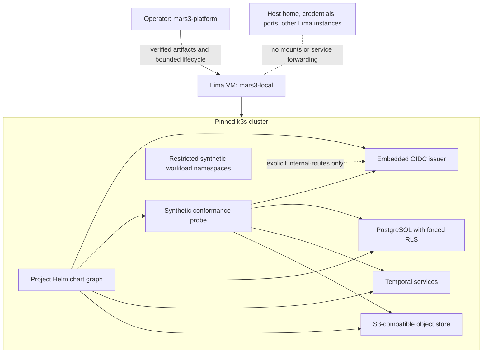

# ADR-006 — Pinned Lima/k3s local substrate

**Status:** Proposed for P-001
**Date:** 2026-08-26
**Owners:** Runtime Architect, Security Engineer
**Goal:** G-001
**Decisions:** PD-001, PD-003
**Feature:** F-003
**Work authority:** external Bead M3-P001 (display ID P-001)

**Implementation state:** Git contract only. P-001 has not been claimed or
implemented, and this ADR grants no runtime authority.

## Context

MARS-3 needs a deterministic environment in which later authority, tracing,
policy, runtime-adapter, and operator-interface slices can be integrated. The
environment must be useful on a developer workstation, share its application
chart graph with the hosted baseline, preserve public-first constraints, and
avoid turning a provider SDK, a workflow engine, or local machine state into
authority.

An unpinned collection of host package-manager installs would make evidence
host-dependent. Running services directly on the host would expose home
directories and credentials to accidental collection. A local Kubernetes
profile without RLS and negative isolation tests would demonstrate deployment,
not tenant safety.

## Decision

Use one named Lima virtual machine as the local host boundary, run one pinned
single-node k3s cluster inside it, and install one project-owned, dependency-
locked Helm chart graph. The local values profile enables embedded OIDC,
PostgreSQL, Temporal, and S3-compatible services. The hosted values profile
uses the same chart graph and contracts while permitting reviewed external
OIDC, managed PostgreSQL, and managed S3 bindings. There is no local-only fork
of application templates.



### Reference pins

The first baseline uses these exact tool versions:

| Component | Pin | Public source |
| --- | --- | --- |
| Lima | `v2.2.0` | `https://github.com/lima-vm/lima/releases/tag/v2.2.0` |
| k3s | `v1.36.3+k3s1` | `https://github.com/k3s-io/k3s/releases/tag/v1.36.3%2Bk3s1` |
| Helm | `v3.21.4` | `https://github.com/helm/helm/releases/tag/v3.21.4` |
| Temporal Helm chart | `temporal-1.6.0` | `https://github.com/temporalio/helm-charts/releases/tag/temporal-1.6.0` |

Helm 3 is selected for the first baseline because the official Temporal chart
contract targets Helm 3. The implementation must add one reviewed lock
manifest under P-001's declared platform paths. It pins the Ubuntu 24.04 LTS
guest image per architecture, release-asset checksums, chart archives and
dependency locks, container images by digest, and license/provenance metadata.
The lock is the only version input; the installer never resolves a `latest`,
channel, mutable tag, or repository index at execution time.

The initial local acceptance target is a supported macOS host with hardware
virtualization. Other host operating systems are not supported merely because
Lima publishes a binary for them; each additional host/architecture requires
its own checked artifact set and reproducible evidence.

### Host and cluster boundary

- The VM is named `mars3-local`; its reviewed Lima configuration contains this
  literal isolation fragment:

  ```yaml
  mounts: []
  portForwards: []
  ```

  No host-home, repository, socket, browser-profile, or credential mount is
  inferred or added dynamically. SSH dynamic, local, and reverse forwarding
  are disabled. The Lima management channel may execute bounded guest commands
  but may not expose an application, datastore, Kubernetes API, or workload
  listener on the host.
- The installer transfers only locked public manifests and artifacts through a
  bounded channel, verifies them before execution, and never passes credentials
  on a command line or through a persisted environment snapshot.
- Guest volumes hold Kubernetes and service state. The host retains only
  public cacheable artifacts and bounded non-secret status; evidence normalizes
  host metadata.
- k3s starts with `--disable=traefik,servicelb`; its API binds only within the
  guest boundary. Admission enables the Kubernetes restricted pod-security
  profile, and network-policy enforcement is a tested prerequisite rather than
  an assumption. The chart rejects `NodePort`, `LoadBalancer`, `hostPort`, and
  `hostNetwork` exposure in the local profile.
- Node-level image acquisition is an installer effect over pinned public
  inputs. Runtime pods start with no Internet egress.

### One chart graph, two bindings

The project chart owns namespaces, service accounts, RBAC, network policies,
pod security contexts, deployments/jobs, service discovery, persistence
claims, configuration schemas, readiness, and conformance hooks. Local values
select embedded components; hosted values select external service endpoints
through the same typed values schema. Unknown values and missing required
bindings fail chart validation.

The local embedded choices are:

- Dex-compatible OIDC for generated synthetic identities and short-lived
  tokens;
- CloudNativePG-managed PostgreSQL with separate migration, runtime, Temporal,
  and identity roles/databases;
- the official Temporal server chart using PostgreSQL persistence; and
- SeaweedFS S3 gateway for synthetic artifact storage.

Their exact chart versions, images, checksums, and licenses are P-001 lock and
notice obligations. Naming a component here is not evidence that it is already
vendored, deployed, qualified, or accepted.

### Identity and RLS boundary

The local issuer generates its signing key, synthetic user authenticators, and
service credentials inside the environment. The conformance client is a public
OIDC client; any bootstrap authenticator is generated at install time and
never printed. Evidence records only reserved subjects and claim classes.

The tenant probe accepts an OIDC token only after checking the configured
issuer, audience, signature, expiry, and immutable subject binding. It derives
`mars3_tenant_id` from the verified binding and ignores any tenant selection in
request input. It starts a database transaction, sets tenant context with
transaction scope, executes tenant work, and closes the transaction before the
connection returns to the pool.

Tenant tables have a non-null tenant key, explicit policies for every command,
and `FORCE ROW LEVEL SECURITY`. A non-login migration owner owns schema; the
runtime login neither owns tenant tables nor has `BYPASSRLS`, role inheritance,
or arbitrary `SET ROLE`. Default privileges are revoked. Separate PostgreSQL
roles and databases prevent Temporal or OIDC services from using the product
runtime role. A direct runtime connection with missing tenant context returns
no tenant data and cannot write.

### Persistence and recovery

PostgreSQL data, Temporal persistence, and S3-compatible object data use
declared persistent volume claims inside the VM. Readiness does not mean
durability: conformance seeds a committed row, a waiting workflow, and an
object digest, then verifies each after pod recreation, deployment rollout,
and a full Lima stop/start.

Temporal owns workflow history and retry execution only. Activities remain
at-least-once and future external effects require idempotency and effect
receipts in later slices. Temporal history is never claim, lease, review, or
release authority. P-001 uses synthetic payloads only and stores no provider
state or secret in workflow input/history.

### Network, service-account, and workload policy

Every namespace receives default-deny ingress and egress before workloads are
ready. Allowed paths are explicit namespace/service/port tuples. Restricted
workloads use an internal-only resolver that serves cluster destinations and
cannot recursively forward public names. System services receive only the
internal routes required for OIDC, PostgreSQL, Temporal, and object storage;
none gets general Internet egress. All APIs and service routes are guest-only;
host socket inspection and negative connection probes must confirm that Lima,
k3s, Helm, and Kubernetes resources created no host-facing listener.

Every component has a dedicated service account, token automount is disabled
unless a reviewed Kubernetes API call requires it, and RBAC contains no
wildcard verb or resource. Restricted workload pods use `RuntimeDefault`
seccomp, drop all capabilities, disallow privilege escalation, run as
non-root, use a read-only root filesystem, and cannot request host namespaces,
host paths, privileged mode, or arbitrary volume types.

These are composable substrate controls, not the S-001 Rule-of-Two policy
engine. P-001 has no real private tenant data and no model/provider runtime. A
later route exposed to external-untrusted input plus private data must remain
without external effect until S-001 proves transitive taint admission and
S-002 supplies constrained brokers. DNS, logging, metrics, and error-reporting
routes count as effects; they are not implicit exceptions.

### Lifecycle state machine

```text
absent -> preflight -> installing -> verifying -> ready
ready -> verifying -> ready
ready -> upgrading -> verifying -> ready
ready -> rolling-back -> verifying -> ready
ready -> stopped -> ready
absent | ready | stopped -> purge-approved -> purge-confirmed -> absent
```

Preflight verifies the exact name, host class, lock, checksums, current chart
revision, storage, dependency state, claim, declared paths, and live lease
before mutation. M3-P001 depends on closed M3-H001 and accepted M3-W001. The
gateway compare-and-swap claim and current PostgreSQL monotonic lease epoch are
mandatory and direct Beads access is denied; P-001 receives no unfenced
bootstrap exception. Repeating `up`, `verify`, `down`, or an already-complete
transition is a successful no-op with a verification receipt.

Helm operations use atomic wait behavior and bounded timeouts. Upgrade first
proves that schema migration and rollback are compatible. An injected failure
must restore the last verified chart revision. A non-reversible migration is
rejected before effect and requires a new architecture decision rather than a
false rollback claim.

`purge` accepts only the literal instance name plus `--approval <opaque-id>`.
The trusted approval record binds operation `purge`, exact instance
`mars3-local`, observed lifecycle state and platform-lock digest, authenticated
requester, a distinct human approver, expiry, and one idempotency key. Its
ledger, effect intent, reconciliation state, and final receipt live in a
trusted local control-plane store outside and unmounted from the Lima deletion
target. Admission verifies those bindings and durably redeems the approval
before the effect. A
replayed, expired, stale-state, stale-lock, wrong-operation, wrong-instance, or
same-requester/approver record fails before deletion. An already-absent no-op
requires a fresh approval bound to that state. The command never resolves a
host path or another Lima instance as part of deletion, and public evidence
retains only the opaque approval reference and bounded outcome.

If the process crashes after redemption, retry with the same idempotency key
loads the surviving intent, reconciles only the exact bound instance/state,
finishes or verifies deletion, and persists a final verified receipt outside
the VM. It cannot reuse the approval for a new operation or state. Ambiguous or
mismatched recovery fails closed for human disposition, and deleting guest
volumes cannot erase approval/replay proof.

Generated secrets are created through the Kubernetes API before Helm and are
referenced only by object name. They are absent from chart defaults, values,
release history, process arguments, command output, traces, and evidence.
Idempotent `up` retains existing secret objects; rotation is a separate
explicit operation and is not an install side effect.

### Trace-spine compatibility

Each platform operation accepts or creates an opaque operation ID and emits a
bounded sequence of transition, preflight/policy outcome, component/version,
effect class, receipt hash, verification outcome, and terminal status. It does
not persist raw command payloads, token values, SQL data, workflow payloads,
object contents, host paths, or machine identity.

This shape can feed T-001, but P-001 does not claim an append-only audit ledger,
OpenTelemetry propagation, Tempo retention, or effect-intent enforcement. A
local log explains a platform transition; it cannot grant work or capability.

### Provider neutrality

No chart, service account, namespace, secret schema, database role, network
exception, or lifecycle command names a model provider. Codex and Claude remain
future `AgentRuntimeAdapter` implementations; open models remain future
`ModelTransport` implementations under `NativeHarnessRuntime`. P-001 deploys
none of them and accepts no API token. Provider credentials will be
broker-injected by S-002 and cannot become Helm values or environment-wide
secrets.

## Alternatives considered

- **Run services directly on the host.** Rejected because host package drift,
  home-directory access, process-environment leakage, and cleanup scope would
  make public evidence and isolation unreliable.
- **Use Docker Desktop or a provider-specific desktop runtime.** Rejected as
  the canonical path because licensing, daemon configuration, and host socket
  exposure vary, while Lima provides an explicit VM boundary and public lockable
  artifacts.
- **Use kind without a VM.** Rejected for the reference profile because the
  container runtime socket and host kernel remain a wider boundary. It may be a
  later fast test profile but cannot substitute for P-001 evidence.
- **Maintain separate local and hosted charts.** Rejected because drift would
  make local acceptance weak evidence for the hosted baseline.
- **Rely on application filters instead of PostgreSQL RLS.** Rejected because a
  missed predicate becomes cross-tenant access. Application checks remain, but
  forced RLS is the storage backstop.
- **Claim full sandbox and Rule-of-Two enforcement in P-001.** Rejected because
  kernel isolation, transitive taint, credential proxying, and effect brokers
  belong to S-001/S-002 and require independent evidence.

## Consequences

The VM and embedded services consume more resources and start more slowly than
host processes or kind. Exact pins require deliberate upgrade work and license
review. A single-node profile proves deterministic lifecycle and restart
recovery, not production availability. Local embedded components and hosted
managed bindings must pass the same contract tests despite different
operations.

This design materially narrows accidental host and tenant exposure while
leaving the hard boundaries truthful: PostgreSQL RLS is a backstop, Kubernetes
network policy is not a kernel sandbox, Temporal is not authority, and a public
local fixture is not hosted multi-tenant proof.

## Required evidence and falsification

P-001 requires deterministic evidence for exact pin verification, clean
one-command creation, repeated-install equality, OIDC-to-RLS positive and
negative cases, controlled restart recovery, compatible upgrade and rollback,
injected atomic failure, non-reversible migration rejection, secret absence,
RBAC and pod-admission denial, default-deny network behavior, internal-only DNS,
literal empty Lima mount/forward sets, disabled k3s ingress/load-balancer
defaults, absence of host-facing listeners, approval-binding/replay denials,
and exact-instance cleanup. QA and Security independently review the same
immutable commit before the Orchestrator can reconcile M3-P001.

The decision is falsified by a floating artifact, host mount, secret in Helm or
evidence, tenant selection from request input, RLS bypass, recursive public DNS
from a restricted workload, excessive service-account authority, lost durable
state, partial rollback, broad cleanup target, replayable or wrongly bound purge
approval, deletion of approval/replay proof, cross-intent crash recovery, any
host mount or forwarded guest listener, enabled Traefik/ServiceLB
or host-facing Kubernetes service, chart fork, provider-specific substrate
dependency, evidence that overstates T-001/S-001/S-002 controls, or an attempt
to begin P-001 before accepted W-001 gateway fencing.

## Out of scope

- Implementing or claiming M3-P001 in this contract-only change.
- Work-authority gateway and live-lease semantics, trace storage, hard
  Rule-of-Two admission, hostile-code isolation, effect/credential brokers,
  model runtimes, provider adapters, agent tools, and operator UI.
- Real credentials or tenant data, production ingress, public endpoints,
  production HA, autoscaling, backup/restore, disaster recovery, multi-region
  operation, and hosted multi-tenant qualification.
